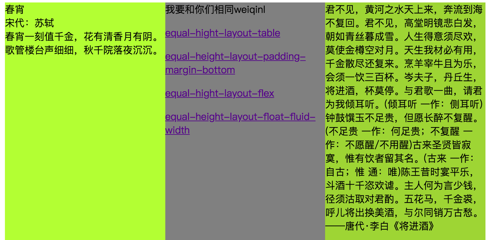

# margin 负值的应用

### margin 为负值，应用到设置多列等高布局

我们在浏览一些网页时，会发现他们不全是就中间一块内容区，左右可能还有导航栏或者其他的一些，就比如图一，他们的内容大小不同，高度也不同，背景颜色不同。

图一：


这样的话，网页会非常难看，我们最终需要的是下面图二这个效果：

图二：



我们另外举个例子：

```html
<!DOCTYPE html>
<html>
<head>
    <title>多列等高</title>
    <link rel="stylesheet" href="./1.css">
</head>
<body>
    <div class="container">
        <div class="left"> height:50px</div>
        <div class="main">height:100px</div>
        <div class="right">height:30px</div>
    </div>
</body>
</html
```

```css
.body {
  margin: 0;
  padding: 0;
}

.container {
  margin: 0 auto;
  width: 100%;
  overflow: hidden;
}
.left {
  height: 50px;
  width: 33.33%;
  margin-bottom: -5000px;
  padding-bottom: 5000px;
  float: left;
  background-color: rgba(33, 114, 214, 0.8);
}
.main {
  height: 100px;
  margin-bottom: -5000px;
  width: 33.33%;
  float: left;
  padding-bottom: 5000px;
  background-color: rgba(255, 82, 0, 0.8);
}
.right {
  width: 33.33%;
  height: 30px;
  float: left;
  margin-bottom: -5000px;
  padding-bottom: 5000px;
  background-color: rgba(90, 243, 151, 0.8);
}
```

在这个例子中，我们在父元素中放了三个子元素，每个子元素我们设置了不同的高，分别是：50px 、100px 、30px，由于父元素没有设置高度，那它的高度就是由子元素最高的那一列撑起来的；这个时候我们要使它们高度一样，也就是多列等高的话就要对他们的高度差进行填充。

打个比方，比如说我们有个快递，它是放在盒子里面的，怕里面的东西碎，填充的有海绵，它的周围还有别的快递，隔得有段距离；盒子里面的东西当做内容区，填充的海绵就是内边距（padding），箱子就是边框（border），这个快递跟其他快递的距离就是外边距（margin）。盒子里面放了三样东西，中间的高度和盒子一样高，两边的就需要填充海绵使他们高度一样，这样就不会碎。

回到我们的例子中，要想三个子元素高度一样，就要对他们的高度差进行填充，也就是对 padding-bottom 进行设定，第一个设为 50px，第三个设为 70px，而 background 的设定是可以用在 padding 上的，这样就达到了三列等高的效果。

但是在我们实际的需求中，中间一列高度是要自适应大小的，当它高度超过 100px，那我们对左右两边内边距的设定就没啥效果了，整体又回到了原来的样子。

所以在这里我们就需要把 padding-bottom 设置的足够大，这个时候光两边的还不行中间的元素也要设置，因为 background 作用不到 margin 上面。

这里我们把 padding-bottom 设置为 5000px，但是当我们把网页拉到最下面时发现，还不是我们要的等高的效果，三个子元素这个时候的高度分别是他们原本的高度加上我们设置的底部的 padding。

就比如我们之前打的那个比方，这个时候由于海绵太大，撑破了盒子，没有了盒子破掉那一面的限制，它的高度就相当于盒子里面的东西的高度加上海绵舒展开的高度。

然后这个时候想要达到多列等高的效果就要对三个子元素底部的 margin 设置成与 padding 等值的负值与之抵消，其实也不能说成抵消，只能说把我们设置的 padding 推了回去，地方就那么大，放不下我们对子元素底部的填充，就会溢出，这个时候我们给父元素设置的 overflow：hidden 就起了作用，hidden 这个值它在将溢出父元素的内容隐藏之前，会先把内容进行裁剪，而父元素的高度是由最高的那一列撑起来的，子元素溢出的就会对左右两边的高度差进行填充，这样就又达到了多列等高的效果。
